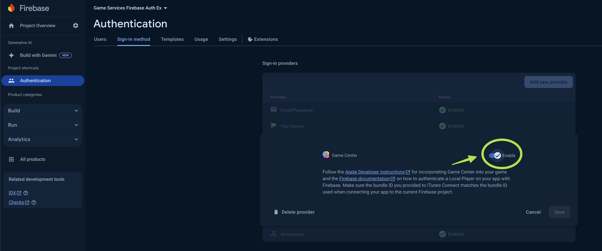
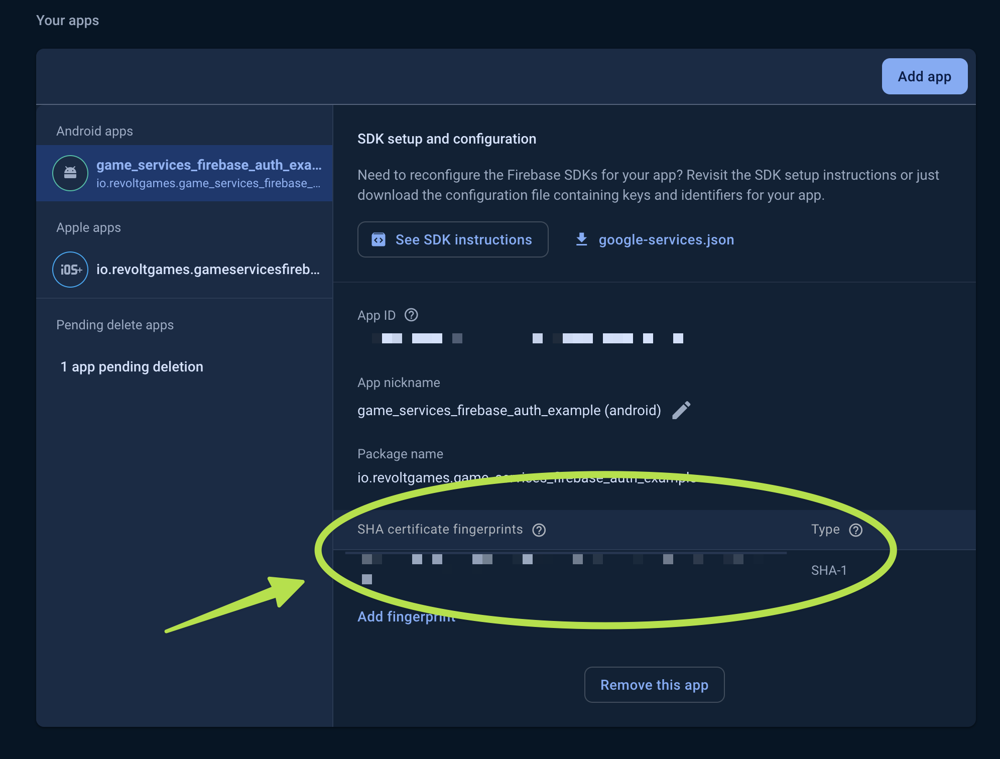

# 🎮 Game Services FirebaseAuth Plugin

A Flutter plugin that simplifies Firebase Authentication using GameCenter on iOS and Play Games on
Android.

## Features

- **Cross-Platform Game Services**: Supports Firebase Authentication with GameCenter on iOS and Play
  Games on Android.
- **Easy Integration**: Minimal code required to sign in, link accounts, and manage authentication
  with game services.

## Installation

To install the package, add the following to your `pubspec.yaml`:

```yaml
dependencies:
  game_services_firebase_auth: ^latest_version
```

Then run:

```bash
flutter pub get
```

Please follow the instructions carefully to set up your project for iOS and Android, especially for
Android, which can be a bit tricky and may lead to ambiguous errors if not set up correctly.


### 🍏 iOS

1. Make sure you have well configure Firebase in your Flutter project. [(Doc here)](https://firebase.google.com/docs/flutter/setup?platform=ios)
2. Open your project in Xcode. In the Signing & Capabilities tab, add the ‘Game Center’ capability [(Doc here)](https://developer.apple.com/documentation/gamekit/enabling_and_configuring_game_center/)
3. Ensure to activate the Game Center Authentication method in the Firebase Console.



### 🤖 Android
1. Make sure you have well configure Firebase in your Flutter project. [(Doc here)](https://firebase.google.com/docs/flutter/setup?platform=android)
2. Get your project SHA-1 keys in your /android folder
```shell
./gradlew signingReport
```
3. Add your SHA-1 keys in your Firebase Console



4. Enable Google Play Games as a sign-in provider:
Find your project's web server client ID and client secret. The web server client ID identifies your Firebase project to the Google Play auth servers.

To find these values:

Open your Firebase project in the Google APIs console credentials page.
In the OAuth 2.0 client IDs section, open the Web client (auto created by Google Service) details page. This page lists your web server client ID and secret.
Then, in the Firebase console, open the Authentication section.

On the Sign in method tab, enable the Play Games sign-in provider. You will need to specify your project's web server client ID and client secret, which you got from the APIs console.


## Usage

### Sign In with Game Services

```dart
await
FirebaseAuth.instance.signInWithGamesServices
();
```

### Check if Current User is Linked with Game Services

```dart
firebaseUser.isLinkedWithGamesServices
();
```

### Link Firebase User with Game Services

```dart
await
firebaseUser.linkWithGamesServices
();
```

### Force Sign In with Game Services if Account Already Linked

```dart
await
firebaseUser.linkWithGamesServices
(
forceSignInWithGameServiceIfCredentialAlreadyUsed
:
true
);
```

## Requirements

- **Firebase Core**
- **Firebase Auth**

## Contributing

Contributions are welcome! Please follow the [contribution guidelines](CONTRIBUTING.md) and basic
open-source practices.

## License

This project is licensed under the BSD-3-Clause License. See the [LICENSE](LICENSE) file for more
details.


